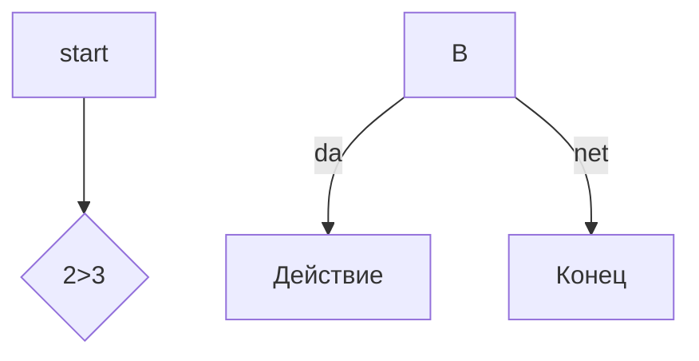

# Заголовок
## Заголовок
### Заголовок 
#### Заголовок
##### Заголовок
###### Заголовок

Выделение текста
-----------------
*Курсив* / _Курсив_
**Жирный** / __Жирный__
***Жирный и курсив*** / ___Жирный и курсив___
~~зачеркнутый~~
'моноширинный код'
Списки
-------

- Пункт
- Пункт 2
 -Вложенный 
 -ещё
* Пункт 3
+ Пункт 4

1. Первый
2. Второй
3. Третий
- [x] 1
- [ ] 2
- [ ] 3

Ссылки
-------
[текст](https://example.com)

[C подсказкой](https://example.com "При наведении")

<https://example.com >

[Ссылочный стиль][1]

[1]: https://example.com


[](https://example.com)

цитаты
-------

>Цитата
>ааа
>> Вложеный
>
Код
----
```markdown
print("hello") Python
```
```pyton
c = a+b
print(f"f{c} = {a} + {b})
```

Таблицы
---------

---: = ориентация спраава
:---: ориентация по центру
:--- = ориентация слева
| name | age | city |
|----:|:----:|:-----|
|ss   |34    |mod   |
|ss   |34    |mod   |
|s    |34    |mod   |
|s    |34    |mod   |


Линии
------
---
***
___

Экранирование
----------------

\# fdf
\[aaaaa]


Диаграмма
-----------

Заголовки
-----------

- [Заголовки](#-заголовки)
-  [Списки](#3-списки)


